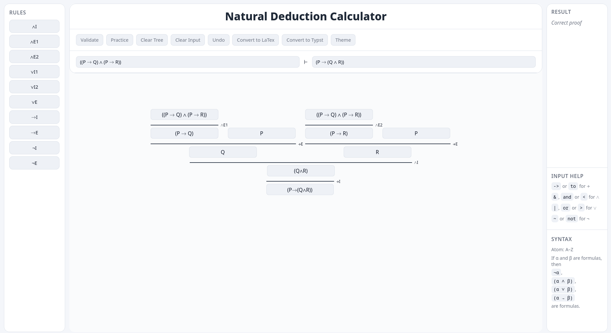

# DeDucktion - A Natural Deduction Calculator

A web-based natural deduction proof editor and validator for propositional logic.
This application allows interactive construction of gentzen-like proof trees, rule application, and formal verification of derivations.

## Setup
```bash
npm install
npm run dev
```

## Features
- Interactive proof tree construction
- Natural deduction rules (∧, ∨, →, ¬)
- Proof validation
- Export to Typst ([Curryst](https://github.com/pauladam94/curryst)) and LaTeX ([Bussproofs](https://ctan.math.utah.edu/ctan/tex-archive/macros/latex/contrib/bussproofs/bussproofs.sty))

## Preview


## Usage
- Enter the premises in the left input field next to the "⊢" (comma-seperated).
- Enter the desired conclusion in the right input field next to the "⊢".
- Construct the proof tree bottom-up, starting with the final inference rule.
- Add rules by clicking on the desired rule in the rule panel.
- To extend the proof, select one of the premises in the tree and apply another rule to it.
- Logical connectives can be entered using keyboard shortcuts (see _Input Help_ in the right panel).

## Requirements
- Node.js 
- npm