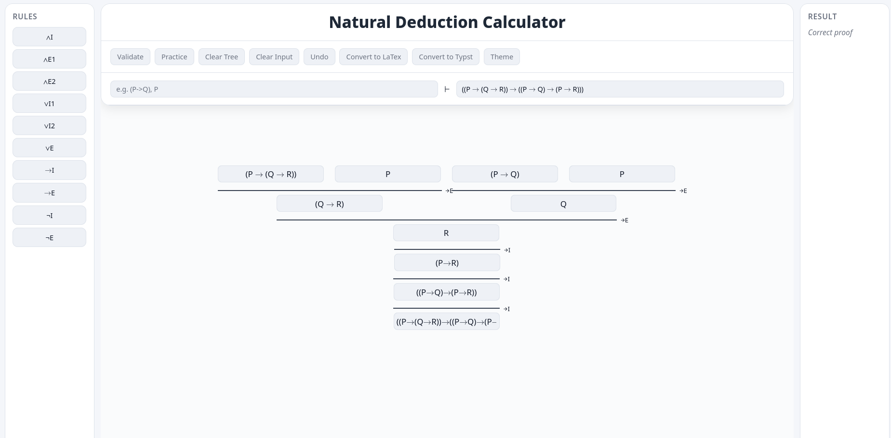

# Natural Deduction Calculator

A web-based natural deduction proof editor and checker for propositional logic.

## Installation
```bash
npm install
npx vite 
```

## Features
- Interactive proof tree construction
- Natural deduction rules (∧, ∨, →, ¬)
- Proof validation
- Export to Typst ([Curryst](https://github.com/pauladam94/curryst)) and LaTeX ([Bussproofs](https://ctan.math.utah.edu/ctan/tex-archive/macros/latex/contrib/bussproofs/bussproofs.sty))
- Zoomable and pannable proof canvas

## Preview
